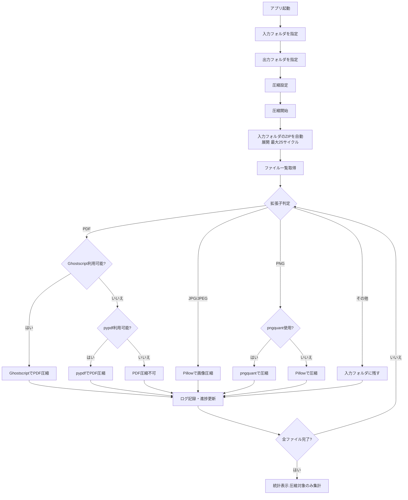
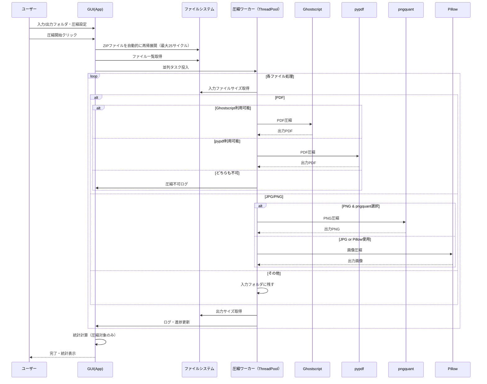
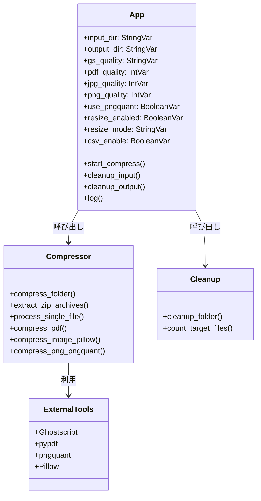

# 追加図面：フロー図、シーケンス図およびクラス図

## 処理フロー（図）

```mermaid
flowchart TD
  A[アプリ起動] --> B[入力フォルダを指定]
  B --> C[出力フォルダを指定]
  C --> D[圧縮設定]
  D --> E[圧縮開始]
  E --> F[入力フォルダのZIPを自動展開 最大25サイクル]
  F --> G[ファイル一覧取得]
  G --> H{拡張子判定}
  H -- PDF --> I{Ghostscript利用可能?}
  I -- はい --> J[GhostscriptでPDF圧縮]
  I -- いいえ --> K{pypdf利用可能?}
  K -- はい --> L[pypdfでPDF圧縮]
  K -- いいえ --> M[PDF圧縮不可]
  H -- JPG/JPEG --> N[Pillowで画像圧縮]
  H -- PNG --> O{pngquant使用?}
  O -- はい --> P[pngquantで圧縮]
  O -- いいえ --> Q[Pillowで圧縮]
  H -- その他 --> R[入力フォルダに残す]
  J --> S[ログ記録・進捗更新]
  L --> S
  M --> S
  N --> S
  P --> S
  Q --> S
  R --> S
  S --> T{全ファイル完了?}
  T -- いいえ --> H
  T -- はい --> U[統計表示 圧縮対象のみ集計]
```

## シーケンス図（圧縮処理の全体フロー）

```mermaid
sequenceDiagram
    participant User as ユーザー
    participant GUI as GUI(App)
    participant FS as ファイルシステム
    participant Worker as 圧縮ワーカー（ThreadPool）
    participant GS as Ghostscript
    participant PYPDF as pypdf
    participant PNGQ as pngquant
    participant PIL as Pillow

    User->>GUI: 入力/出力フォルダ・圧縮設定
    User->>GUI: 圧縮開始クリック
    GUI->>FS: ZIPファイルを自動的に再帰展開（最大25サイクル）
    GUI->>FS: ファイル一覧取得
    GUI->>Worker: 並列タスク投入

    loop 各ファイル処理
        Worker->>FS: 入力ファイルサイズ取得
        
        alt PDF
            alt Ghostscript利用可能
                Worker->>GS: PDF圧縮
                GS-->>Worker: 出力PDF
            else pypdf利用可能
                Worker->>PYPDF: PDF圧縮
                PYPDF-->>Worker: 出力PDF
            else どちらも不可
                Worker->>GUI: 圧縮不可ログ
            end
        else JPG/PNG
            alt PNG & pngquant選択
                Worker->>PNGQ: PNG圧縮
                PNGQ-->>Worker: 出力PNG
            else JPG or Pillow使用
                Worker->>PIL: 画像圧縮
                PIL-->>Worker: 出力画像
            end
        else その他
            Worker->>Worker: 入力フォルダに残す
        end
        
        Worker->>FS: 出力サイズ取得
        Worker->>GUI: ログ・進捗更新
    end

    GUI->>GUI: 統計計算（圧縮対象のみ）
    GUI-->>User: 完了・統計表示
```

## クラス図（主要コンポーネントと責務）

```mermaid
classDiagram
    class App {
        +input_dir: StringVar
        +output_dir: StringVar
        +gs_quality: StringVar
        +pdf_quality: IntVar
        +jpg_quality: IntVar
        +png_quality: IntVar
        +use_pngquant: BooleanVar
        +resize_enabled: BooleanVar
        +resize_mode: StringVar
        +csv_enable: BooleanVar
        +start_compress()
        +cleanup_input()
        +cleanup_output()
        +log()
    }

    class Compressor {
        +compress_folder()
        +extract_zip_archives()
        +process_single_file()
        +compress_pdf()
        +compress_image_pillow()
        +compress_png_pngquant()
    }

    class Cleanup {
        +cleanup_folder()
        +count_target_files()
    }

    class ExternalTools {
        +Ghostscript
        +pypdf
        +pngquant
        +Pillow
    }

    App --> Compressor : 呼び出し
    App --> Cleanup : 呼び出し
    Compressor --> ExternalTools : 利用
```

<!--

-->