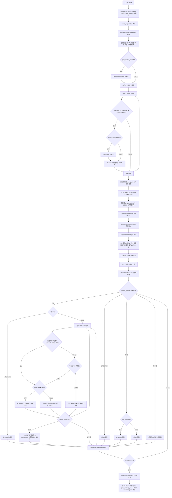
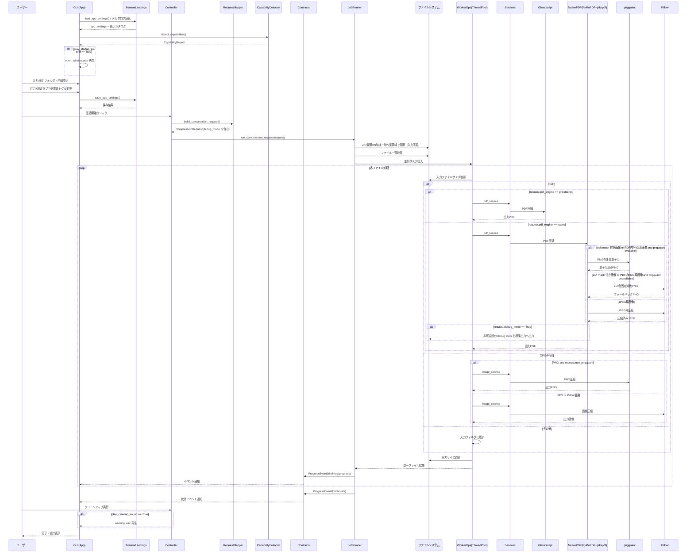
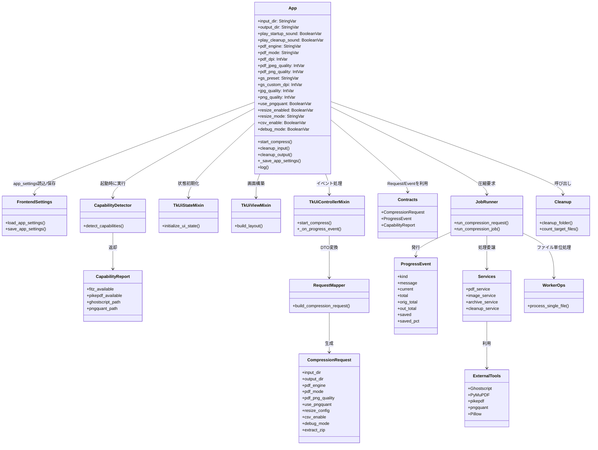

# 追加図面：フロー図、シーケンス図およびクラス図

## 改修関連ドキュメント

- README（HTML）: [README.html](./README.html)
- README（Markdown）: [README.md](./README.md)

## 処理フロー（図）



## シーケンス図（圧縮処理の全体フロー）



## クラス図（主要コンポーネントと責務）



## 設定レイヤ構成（2026年3月15日追記）

設定まわりは単一の `shared/configs.py` から、所有責務ごとの層へ再編しました。

- `shared/runtime_paths.py`
  通常実行と PyInstaller 実行の両方で使う `APP_BASE_DIR` / `RESOURCE_BASE_DIR` を提供します。
  Path 計算や `sys.frozen` / `sys._MEIPASS` 判定のような runtime 依存ロジックはここへ集約します。
- `backend/settings.py`
  PDF 圧縮既定値、Ghostscript 既定プリセット、backend が許可する PDF モード値を保持します。
  backend は UI 表示ラベルに依存せず、`PDF_ALLOWED_MODES` のような処理都合の値だけを参照します。
- `frontend/settings.py`
  UI の既定値、cleanup 対象拡張子、サウンド/画像リソースパス、表示カタログローダを保持します。
  frontend が JSON を読む責務はここに閉じ込め、画面コードはロード済み定数だけを使います。
- `frontend/config_data/ui_catalogs.json`
  純粋データだけを置く領域です。現時点では PDF モード表示名、Ghostscript プリセット表示名、長辺プリセットを管理します。
  Path、OS 判定、PyInstaller 判定のようなロジックはここへ入れません。
- `shared/configs.py`
  旧 import 互換のための再エクスポート層です。
  新規コードは原則としてこのモジュールを直接参照せず、runtime / backend / frontend の各設定モジュールを直接参照します。

## 今回の改修（v2.5.0 / 2026年3月30日追記）

- 対象バージョンは `pyproject.toml` の `2.5.0` です。
- ネイティブ PDF 非可逆圧縮で、PDF 内 PNG 系画像を JPEG へ逃がさず PNG のまま量子化するフローへ変更しました。
- PDF 用設定から `PNG→JPEG変換` を廃止し、`PNG品質` スライダーを追加しました。
- `pngquant` が利用可能な環境では、PDF 用 PNG 品質スライダー値を上限とした quality 範囲で量子化します。
- `pngquant` が利用できない環境では、Pillow の 256 色固定減色へフォールバックし、UI では PDF 用 PNG 品質スライダーを無効化して理由を注記します。
- `backend/contracts.py` の `CompressionRequest` は `pdf_png_quality` を持つようになり、worker まで同値が伝搬します。

この改修が必要だった理由:

- PDF 内 PNG 系画像を JPEG へ逃がす設計は、透明情報や PNG 素材由来の特性を崩しやすく、設定意図が UI から読み取りにくかったため。
- `pngquant` が導入されている環境と未導入の環境で、どの品質ノブが実際に効くのかを UI と backend の両方で明確にする必要があったため。
- `pdf_png_quality` を request 契約へ昇格させておくことで、controller のログ、worker の分岐、将来の回帰テストが同じ意味で追えるようになるため。

## PDF soft mask 透過保持（2026年3月30日追記）

`backend/core/pdf_utils.py` の `compress_pdf_lossy()` は、PDF 画像本体とは別 xref に置かれた `SMask` を読み取り、透過を 1 枚の Pillow 画像へ再構成してから再圧縮するようになりました。

今回の変更内容:

- `doc.extract_image(xref)` の戻り値に `smask` がある場合、mask 側の画像も抽出して alpha として再構成します。
- 内部拡張子が JPEG 系でも、再構成後に透過が存在する画像は PNG 再圧縮経路へ送ります。
- `pngquant` が利用できない場合でも、透過付き画像は Pillow の 256 色固定減色 PNG へフォールバックします。
- soft mask の抽出または decode に失敗した場合は、処理全体を止めずに従来の raster 圧縮へ戻し、debug stats に失敗件数を残します。

この変更が必要だった理由:

- WeasyPrint 由来 PDF では、HTML 上の透過 PNG が PDF 内部で `base image + /SMask` に分かれて格納されることがあるため。
- 画像本体だけを再圧縮して `replace_image()` すると、見た目は PNG 素材でも透過情報を取り落として黒背景化し得るため。
- ext ベースだけで PNG/JPEG を分けると、「見た目は透過ありだが内部形式は JPEG + soft mask」というケースを正しく扱えないため。

関連テスト:

- `tests/unit/test_pdf_utils.py` で、soft mask を再構成して透過を保ったまま PNG 経路へ送ることを unit テスト化しています。
- 同ファイルで、soft mask 抽出失敗時に処理全体は継続し、debug 出力で追跡できることも確認しています。

## 設定レイヤ再編が必要だった理由

- shared を「なんでも置き場」にすると、責務境界が曖昧になり、どの層がその値を所有しているのか説明しづらくなるため。
- backend の検証ロジックと frontend の表示ラベルを切り離さないと、画面都合の変更が処理条件へ波及しやすくなるため。
- JSON 化は純粋データだけに限定し、Path や PyInstaller 判定のような runtime ロジックは Python 側へ残すことで、配布と起動の責務を壊さずに整理するため。
- one-folder 配布でも `frontend/config_data/` を含める対象が明確になり、配布漏れを避けやすくするため。

## PyMuPDF 実描画画像 xref 走査（2026年3月15日追記）

`backend/core/pdf_utils.py` の `compress_pdf_lossy()` は、PyMuPDF による PDF 内画像の非可逆再圧縮を担当します。

今回の変更内容:

- `page.get_images(full=True)` ベースの走査をやめ、`page.get_image_info(xrefs=True)` ベースへ変更しました。
- 実際にページ上へ描画されている画像だけを対象にし、`bbox` をそのまま使って実表示サイズから DPI を計算します。
- 同じ xref は `processed_xrefs` で 1 回だけ判定し、`replace_image()` 後に別ページで再 replace しません。
- xref が欠落している情報や zero bbox は、その場の skip 理由として debug に残しつつ安全に通過します。

この変更が必要だった理由:

- `page.get_images(full=True)` は「そのページの resources に登録された画像」を返すため、「そのページで実描画されている画像」と一致しないことがあります。
- 特に WeasyPrint 系 PDF では、先頭ページの resources に後続ページの画像 xref が見えていても、そのページの `get_image_rects(xref)` は空になることがあります。
- 旧実装ではこの負の結果を xref 単位の失敗キャッシュとして扱っていたため、後続ページで本当に描画されている画像も再確認せず skip され、`replaced_count=0` のような誤った結果になり得ました。
- 実描画画像ベースへ寄せることで、debug summary も `image_infos_seen`、`skip_already_processed`、`replaced`、`skip_not_smaller` といった意味の揃った値になり、原因分析しやすくなります。

関連テスト:

- `tests/unit/test_pdf_utils.py` で、`get_image_info(xrefs=True)` を使うこと、同じ xref を 1 回だけ処理すること、xref 欠落と zero bbox を安全にスキップすることを unit テスト化しています。

## ui_contracts.py（2026年3月11日追記）

frontend 配下の型契約整理に合わせて、`frontend/ui_contracts.py` の現行内容を記録します。

```python
from __future__ import annotations

import threading
import tkinter as tk
from tkinter import ttk
from typing import Any, Callable, Protocol

from backend.contracts import CapabilityReport


class CompressionRequestAppProtocol(Protocol):
    input_dir: tk.StringVar
    output_dir: tk.StringVar
    jpg_quality: tk.IntVar
    png_quality: tk.IntVar
    use_pngquant: tk.BooleanVar
    pdf_engine: tk.StringVar
    pdf_mode: tk.StringVar
    pdf_dpi: tk.IntVar
    pdf_jpeg_quality: tk.IntVar
    pdf_png_quality: tk.IntVar
    pdf_ll_linearize: tk.BooleanVar
    pdf_ll_object_streams: tk.BooleanVar
    pdf_ll_clean_metadata: tk.BooleanVar
    pdf_ll_recompress_streams: tk.BooleanVar
    pdf_ll_remove_unreferenced: tk.BooleanVar
    gs_preset: tk.StringVar
    gs_custom_dpi: tk.IntVar
    gs_use_lossless: tk.BooleanVar
    resize_enabled: tk.BooleanVar
    resize_mode: tk.StringVar
    resize_width: tk.StringVar
    resize_height: tk.StringVar
    resize_keep_aspect: tk.BooleanVar
    long_edge_value_str: tk.StringVar
    csv_enable: tk.BooleanVar
    csv_path: tk.StringVar
    extract_zip: tk.BooleanVar
    copy_non_target_files: tk.BooleanVar


class DropEventProtocol(Protocol):
    data: str


class TkUiControllerHostProtocol(CompressionRequestAppProtocol, Protocol):
    capabilities: CapabilityReport
    threads: list[threading.Thread]
    default_input_dir: str
    default_output_dir: str
    auto_switch_log_tab: tk.BooleanVar
    status_var: tk.StringVar
    stats_var: tk.StringVar
    pdf_engine_status_var: tk.StringVar
    notebook: ttk.Notebook
    log_tab: ttk.Frame
    native_rb: ttk.Radiobutton
    gs_rb: ttk.Radiobutton
    native_frame: ttk.Frame
    gs_frame: ttk.Frame
    _native_lossy_widgets: list[tk.Misc]
    dpi_scale: tk.Scale
    jpeg_q_scale: tk.Scale
    jpeg_note_label: ttk.Label
    _native_lossless_widgets: list[ttk.Checkbutton]
    _gs_custom_dpi_widgets: list[tk.Misc]
    _gs_lossless_widgets: list[ttk.Checkbutton]
    resize_width_entry: ttk.Entry
    resize_height_entry: ttk.Entry
    resize_keep_aspect_chk: ttk.Checkbutton
    resize_mode_manual_rb: ttk.Radiobutton
    resize_mode_long_rb: ttk.Radiobutton
    long_edge_combo: ttk.Combobox
    progress: ttk.Progressbar
    log_text: tk.Text
    tk: Any

    def after(self, ms: int, func: Callable[[], object] | None = None, *args: object) -> str | None:
        ...

    def update_idletasks(self) -> None:
        ...

    def destroy(self) -> None:
        ...
```

<!--
<script>
document.addEventListener("DOMContentLoaded", function () {
  function setupPanzoom() {
    document.querySelectorAll('.mermaid svg').forEach(function(svg) {
      // .no-contain の場合はcontainオプションを付けない
      const hasNoContain = svg.parentElement.classList.contains('no-contain');
      const panzoom = Panzoom(svg, {
        maxScale: 10,
        minScale: 0.5,
        ...(hasNoContain ? {} : { contain: 'outside' })
      });
      svg.parentElement.addEventListener('wheel', function(event) {
        panzoom.zoomWithWheel(event);
      });
    });
  }
  setTimeout(setupPanzoom, 800);
});
</script>
-->

## 関連ドキュメント

- [README（HTML）](./README.html)
- [README（Markdown）](./README.md)

## 今回の改修（2026-03-06）

- 出力設定に「圧縮対象外のファイルを出力フォルダへコピー」トグルを追加（既定OFF）。
- トグルON時、未対応拡張子（`.pdf/.jpg/.jpeg/.png` 以外）を入力フォルダの相対構造を維持したまま出力先へコピー。
- トグルON時、圧縮対象拡張子でも圧縮失敗したファイルはフォールバックとして元ファイルをコピー。
- `CompressionRequest` に `copy_non_target_files` を追加し、UI設定からジョブ実行まで伝播。
- ZIP展開ON時、入力フォルダは変更せず一時作業領域で再帰展開する方式へ変更。
- ZIP展開ON時、展開由来ファイルは `出力/ZIP元相対パス/ZIP stem/` 配下へ内部構造を維持して出力。
- ZIP処理の組み合わせ仕様を明確化。
- ミラーOFF + ZIP展開ON: ZIP由来の圧縮対象のみ出力（非対象は出力しない）。
- ミラーOFF + ZIP展開OFF: ZIP処理をスキップ。
- ミラーON + ZIP展開ON: ZIP本体をコピーし、ZIP由来の圧縮対象を圧縮、非対象もコピー。
- ミラーON + ZIP展開OFF: ZIP本体をコピー。

## 今回の改修（2026-03-11）

- frontend 配下の Pylance 警告を解消するため、型付けの土台を追加。
- `frontend/ui_contracts.py` を追加し、`frontend/ui_tkinter_mapper.py` の `app: Any` を Protocol ベースの契約へ変更。
- `frontend/ui_tkinter_state.py` の Tkinter 変数群に明示的な型注釈を追加。
- `frontend/ui_tkinter_view.py` に widget 属性・Tk 本体前提・controller/state 依存の型注釈を追加。
- `tkinterdnd2` の `drop_target_register` / `dnd_bind` は局所 Protocol + `cast` で扱い、広域 suppress を回避。
- frontend 全体の Pylance 診断で警告 0 を確認。
- `scripts/tkinter_regression_check.py` を実行し、主要GUIフローが `manual-regression-simulated: PASS` で通過することを確認。
