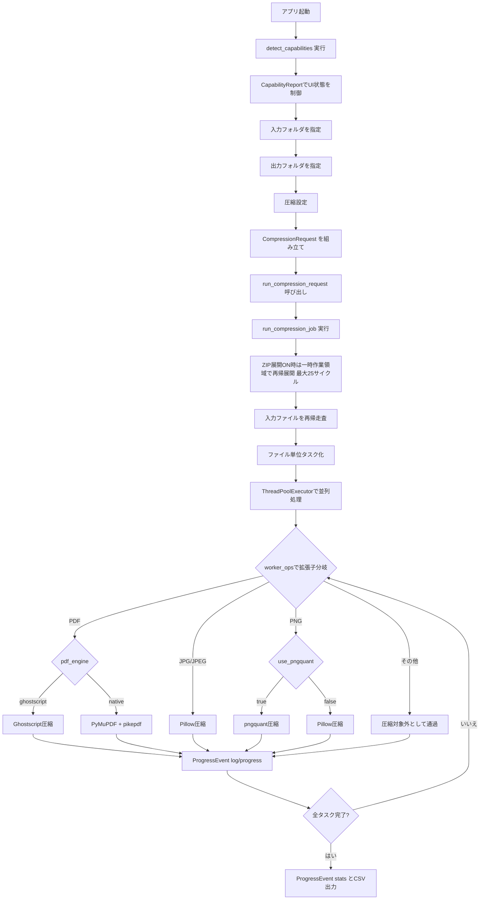
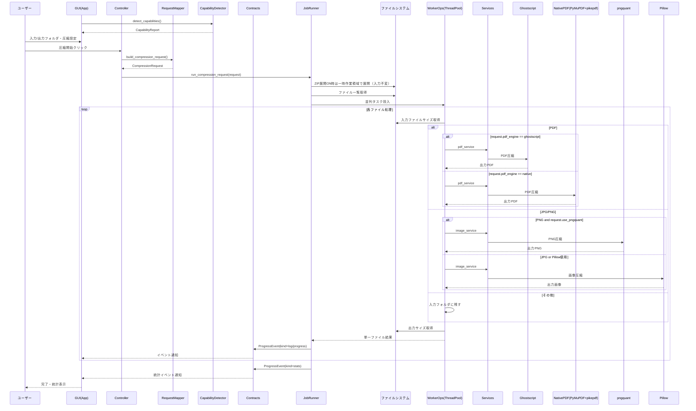
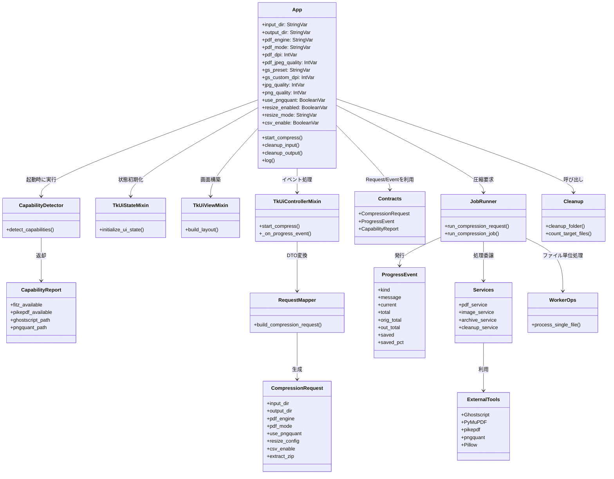

# 追加図面：フロー図、シーケンス図およびクラス図

## 改修関連ドキュメント

- README（HTML）: [README.html](./README.html)
- README（Markdown）: [README.md](./README.md)

## 処理フロー（図）



## シーケンス図（圧縮処理の全体フロー）



## クラス図（主要コンポーネントと責務）



## ui_contracts.py（2026年3月11日追記）

frontend 配下の型契約整理に合わせて、`frontend/ui_contracts.py` の現行内容を記録します。

```python
from __future__ import annotations

import threading
import tkinter as tk
from tkinter import ttk
from typing import Any, Callable, Protocol

from backend.contracts import CapabilityReport


class CompressionRequestAppProtocol(Protocol):
    input_dir: tk.StringVar
    output_dir: tk.StringVar
    jpg_quality: tk.IntVar
    png_quality: tk.IntVar
    use_pngquant: tk.BooleanVar
    pdf_engine: tk.StringVar
    pdf_mode: tk.StringVar
    pdf_dpi: tk.IntVar
    pdf_jpeg_quality: tk.IntVar
    pdf_png_to_jpeg: tk.BooleanVar
    pdf_ll_linearize: tk.BooleanVar
    pdf_ll_object_streams: tk.BooleanVar
    pdf_ll_clean_metadata: tk.BooleanVar
    pdf_ll_recompress_streams: tk.BooleanVar
    pdf_ll_remove_unreferenced: tk.BooleanVar
    gs_preset: tk.StringVar
    gs_custom_dpi: tk.IntVar
    gs_use_lossless: tk.BooleanVar
    resize_enabled: tk.BooleanVar
    resize_mode: tk.StringVar
    resize_width: tk.StringVar
    resize_height: tk.StringVar
    resize_keep_aspect: tk.BooleanVar
    long_edge_value_str: tk.StringVar
    csv_enable: tk.BooleanVar
    csv_path: tk.StringVar
    extract_zip: tk.BooleanVar
    copy_non_target_files: tk.BooleanVar


class DropEventProtocol(Protocol):
    data: str


class TkUiControllerHostProtocol(CompressionRequestAppProtocol, Protocol):
    capabilities: CapabilityReport
    threads: list[threading.Thread]
    default_input_dir: str
    default_output_dir: str
    auto_switch_log_tab: tk.BooleanVar
    status_var: tk.StringVar
    stats_var: tk.StringVar
    pdf_engine_status_var: tk.StringVar
    notebook: ttk.Notebook
    log_tab: ttk.Frame
    native_rb: ttk.Radiobutton
    gs_rb: ttk.Radiobutton
    native_frame: ttk.Frame
    gs_frame: ttk.Frame
    _native_lossy_widgets: list[tk.Misc]
    dpi_scale: tk.Scale
    jpeg_q_scale: tk.Scale
    jpeg_note_label: ttk.Label
    _native_lossless_widgets: list[ttk.Checkbutton]
    _gs_custom_dpi_widgets: list[tk.Misc]
    _gs_lossless_widgets: list[ttk.Checkbutton]
    resize_width_entry: ttk.Entry
    resize_height_entry: ttk.Entry
    resize_keep_aspect_chk: ttk.Checkbutton
    resize_mode_manual_rb: ttk.Radiobutton
    resize_mode_long_rb: ttk.Radiobutton
    long_edge_combo: ttk.Combobox
    progress: ttk.Progressbar
    log_text: tk.Text
    tk: Any

    def after(self, ms: int, func: Callable[[], object] | None = None, *args: object) -> str | None:
        ...

    def update_idletasks(self) -> None:
        ...

    def destroy(self) -> None:
        ...
```

<!--
<script>
document.addEventListener("DOMContentLoaded", function () {
  function setupPanzoom() {
    document.querySelectorAll('.mermaid svg').forEach(function(svg) {
      // .no-contain の場合はcontainオプションを付けない
      const hasNoContain = svg.parentElement.classList.contains('no-contain');
      const panzoom = Panzoom(svg, {
        maxScale: 10,
        minScale: 0.5,
        ...(hasNoContain ? {} : { contain: 'outside' })
      });
      svg.parentElement.addEventListener('wheel', function(event) {
        panzoom.zoomWithWheel(event);
      });
    });
  }
  setTimeout(setupPanzoom, 800);
});
</script>
-->

## 関連ドキュメント

- [README（HTML）](./README.html)
- [README（Markdown）](./README.md)

## 今回の改修（2026-03-06）

- 出力設定に「圧縮対象外のファイルを出力フォルダへコピー」トグルを追加（既定OFF）。
- トグルON時、未対応拡張子（`.pdf/.jpg/.jpeg/.png` 以外）を入力フォルダの相対構造を維持したまま出力先へコピー。
- トグルON時、圧縮対象拡張子でも圧縮失敗したファイルはフォールバックとして元ファイルをコピー。
- `CompressionRequest` に `copy_non_target_files` を追加し、UI設定からジョブ実行まで伝播。
- ZIP展開ON時、入力フォルダは変更せず一時作業領域で再帰展開する方式へ変更。
- ZIP展開ON時、展開由来ファイルは `出力/ZIP元相対パス/ZIP stem/` 配下へ内部構造を維持して出力。
- ZIP処理の組み合わせ仕様を明確化。
- ミラーOFF + ZIP展開ON: ZIP由来の圧縮対象のみ出力（非対象は出力しない）。
- ミラーOFF + ZIP展開OFF: ZIP処理をスキップ。
- ミラーON + ZIP展開ON: ZIP本体をコピーし、ZIP由来の圧縮対象を圧縮、非対象もコピー。
- ミラーON + ZIP展開OFF: ZIP本体をコピー。

## 今回の改修（2026-03-11）

- frontend 配下の Pylance 警告を解消するため、型付けの土台を追加。
- `frontend/ui_contracts.py` を追加し、`frontend/ui_tkinter_mapper.py` の `app: Any` を Protocol ベースの契約へ変更。
- `frontend/ui_tkinter_state.py` の Tkinter 変数群に明示的な型注釈を追加。
- `frontend/ui_tkinter_view.py` に widget 属性・Tk 本体前提・controller/state 依存の型注釈を追加。
- `tkinterdnd2` の `drop_target_register` / `dnd_bind` は局所 Protocol + `cast` で扱い、広域 suppress を回避。
- frontend 全体の Pylance 診断で警告 0 を確認。
- `scripts/tkinter_regression_check.py` を実行し、主要GUIフローが `manual-regression-simulated: PASS` で通過することを確認。
